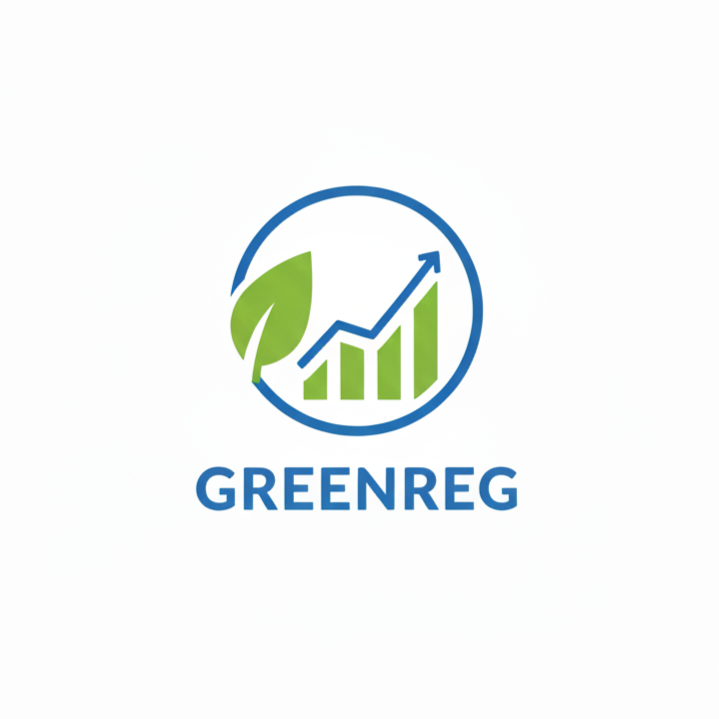

#  GREENREG: Herramienta para el Análisis Estadístico y Ambiental

[](#)
[](https://www.gnu.org/licenses/gpl-3.0)
[](#)

**GREENREG** es un paquete de R diseñado para democratizar el análisis estadístico riguroso, con un enfoque especial en la enseñanza agrícola y ambiental en la **Universidad Autónoma Chapingo**. Su objetivo es transformar la complejidad de los modelos econométricos y de series de tiempo en interpretaciones claras, accionables y visualmente impactantes.

## 🚀 ¿Por qué GREENREG?

A diferencia de las funciones estándar de R (`lm`, `glm`, `arima`), GREENREG actúa como un **consultor virtual** que no solo entrega números, sino que audita tus modelos y te explica qué significan los resultados en lenguaje natural.

### Aspectos Clave y Ventajas:
- **Auditoría Automática de Supuestos:** Cada modelo ejecuta internamente pruebas de normalidad, homocedasticidad, independencia y multicolinealidad sin comandos adicionales.
- **Interpretación en Lenguaje Natural:** Genera un sistema de "Notas y Semáforos" (✅, ⚠️, ❌) que indica si el modelo es confiable o si requiere transformaciones.
- **Secuencias de Diagnóstico Educativas:** Los métodos `plot()` despliegan de 8 a 10 gráficas pedagógicas con pies de figura que explican cómo interpretar cada diagnóstico.
- **Asistente Interactivo:** La función `analisis_datos()` guía al usuario a través de un menú para seleccionar el mejor modelo según su variable objetivo.
- **Optimización Inteligente:** Incluye algoritmos de selección de variables (Stepwise AIC) y búsqueda en rejilla (Grid Search) para series de tiempo.

## 📦 Instalación

Puedes instalar la versión de desarrollo desde GitHub (requiere `devtools`):

```r
# install.packages("devtools")
devtools::install_github("adonnay-bazaldua/GREENREG")
```

## 🛠️ Estructura del Repositorio

```text
GREENREG/
├── R/                 # Motores de cálculo y lógica de modelos
├── data/              # Conjuntos de datos ambientales para práctica
├── man/               # Documentación detallada de funciones
├── tests/             # Scripts de validación y auditoría
├── inst/logo/         # Identidad visual del proyecto
├── DESCRIPTION        # Metadatos y dependencias
└── NAMESPACE          # Gestión de exportaciones e importaciones
```

## 📋 Uso Básico

### 1. Regresión Lineal Simple (RLS)
```r
library(GREENREG)
data("datos_rendimiento_maiz")

# Ajuste del modelo con diagnóstico automático
modelo <- rls(rendimiento_maiz_ton_ha ~ precipitacion_mm, data = datos_rendimiento_maiz)

# Reporte interpretado
print(modelo)

# Galería de diagnóstico (9 gráficas interactivas)
plot(modelo)
```

### 2. Series de Tiempo (ARMA)
```r
data("datos_anomalia_temperatura")
ts_data <- datos_anomalia_temperatura$anomalia_c

# Ajuste y verificación de estabilidad
modelo_ts <- modelo_arma(ts_data, p = 1, q = 1)
plot(modelo_ts)
```

## 🎓 Contribución y Educación

Este proyecto nació para apoyar a la comunidad académica. Si eres estudiante o investigador, GREENREG está diseñado para ser tu primer paso firme hacia la ciencia de datos aplicada.

---
**Desarrollado por:** Dayron Jared Bazán Guzmán  
**Contacto:** dbazanguzman@gmail.com
